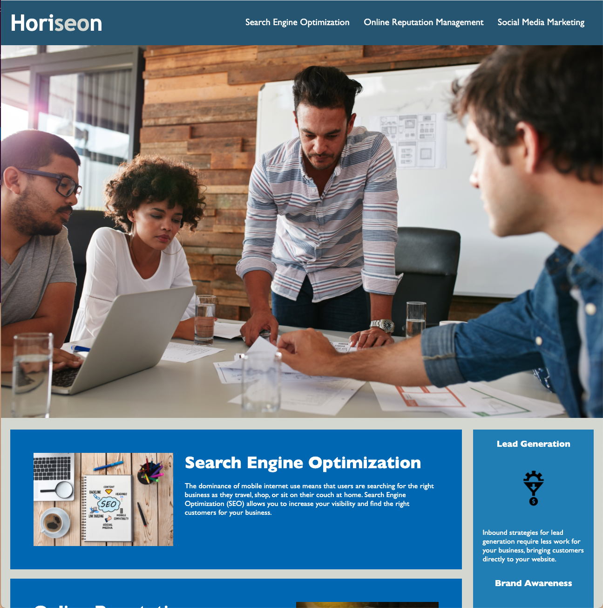

# marketing-agency

## Description 

This is a website for a ficticious marketing agency. The goal of this exercise was to take the existing code provided to me aand refractor it. These means that any changes I made on the html and css codes would not affect the front end of the website. No matter how many changes I made, the front end had to look the same at the end as it did when I first started working in it. The end goal was to take a "broken" website and make it accessible. Making the website accessible is good for many reasons including business aspects, but one of the most important is because it makes it easier for people, especially people disabilities, to find and access the website. Some of the changes that were requires include the adding of HTML semantic elements and fixing the css layout to make it look more consistent and clean.

'''html
<body>
    <!-- Changed the div tags to header and nav, respectively -->
    <header>
        <h1>Horiseon</h1>
        <nav>
            <ul>
                <li><a href="#search-engine-optimization">Search Engine Optimization</a></li>
                <li><a href="#online-reputation-management">Online Reputation Management</a></li>
                <li><a href="#social-media-marketing">Social Media Marketing</a></li>
            </ul>
        </nav>
    </header>
'''

## Deployed Link

Link to deplyed application: https://claudialhc.github.io/marketing-agency/
